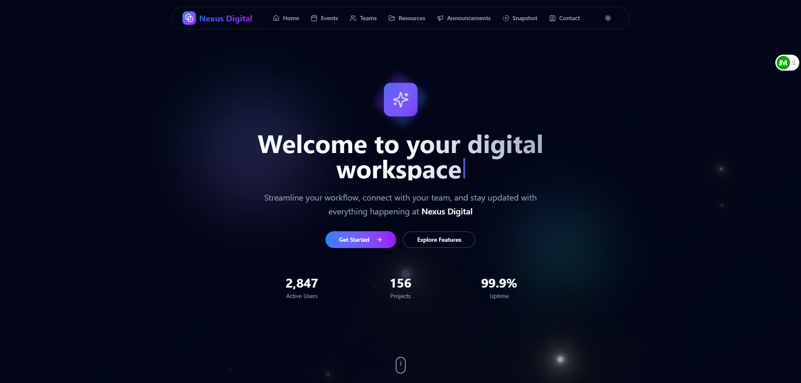
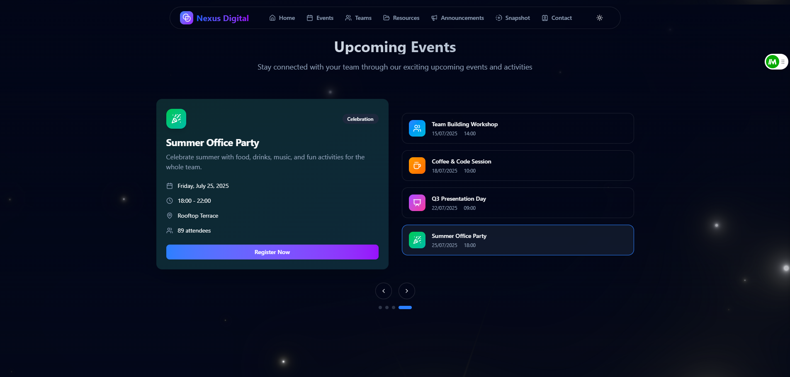
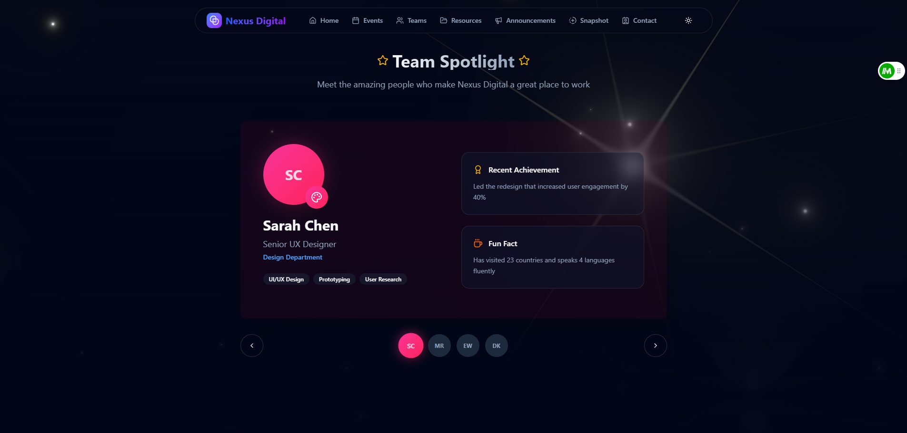
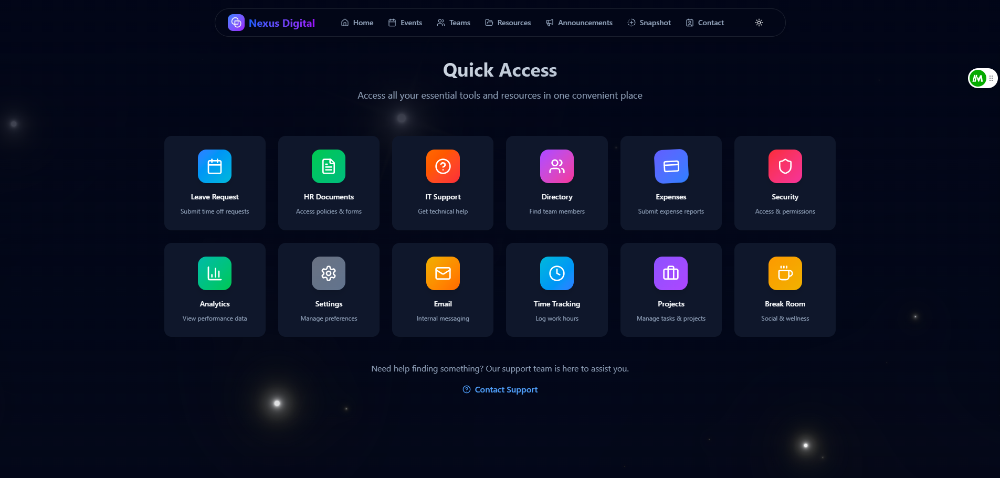
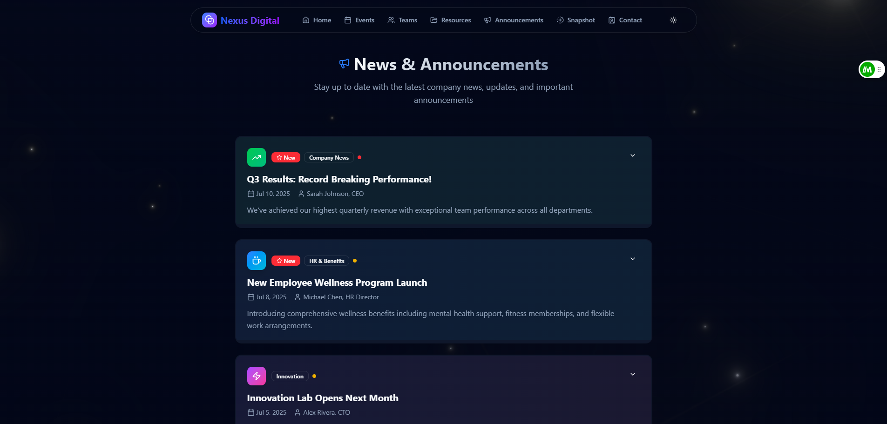
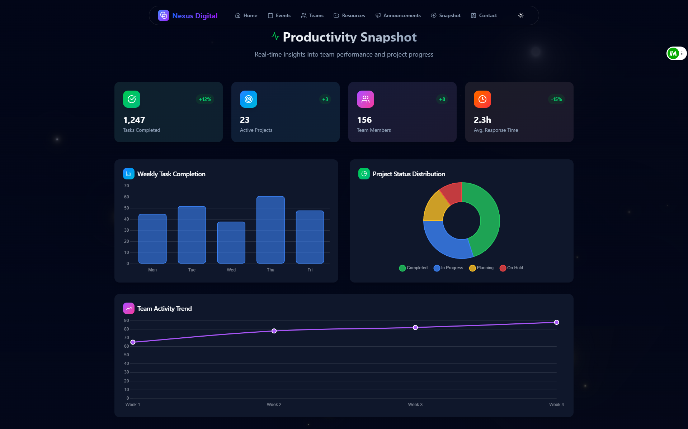
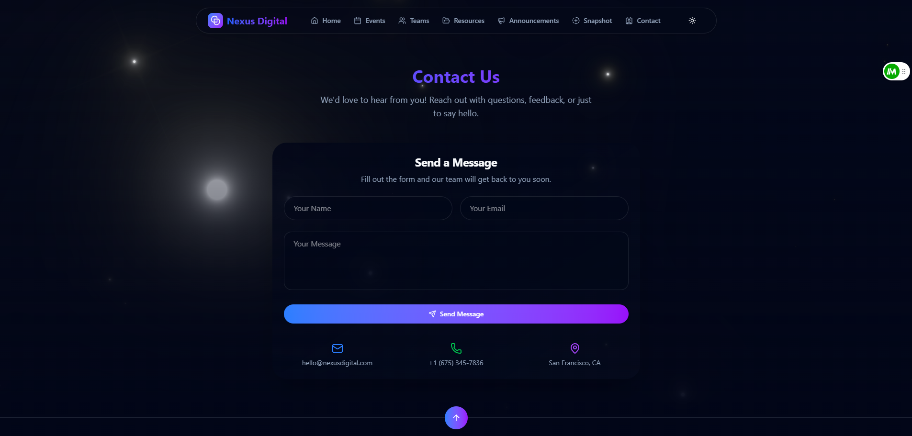
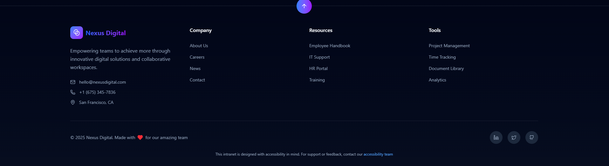

# Nexus Digital Intranet Homepage

A modern intranet portal built with React, TypeScript, Tailwind CSS, and Vite. This project provides a beautiful, interactive homepage for your organization, featuring team spotlights, productivity snapshots, quick access tools, news announcements, and more.

## Features

- **Animated Hero Section**: Typewriter effect and animated backgrounds.
- **Upcoming Events**: Carousel of team events and activities.
- **Team Spotlight**: Highlight team members and achievements.
- **Quick Access**: Grid of essential resources and tools.
- **News & Announcements**: Expandable cards for company updates.
- **Productivity Snapshot**: Real-time charts and stats.
- **Contact Section**: Animated contact form.
- **Responsive Design**: Works on desktop and mobile.
- **Dark/Light Theme**: Toggle between themes.

## 🚀 Live Demo

🌐 [View the Project](https://nexus-digital-henna.vercel.app)

## Screenshots










## Tech Stack

- [React](https://react.dev/)
- [TypeScript](https://www.typescriptlang.org/)
- [Vite](https://vitejs.dev/)
- [Tailwind CSS](https://tailwindcss.com/)
- [Framer Motion](https://www.framer.com/motion/)
- [GSAP](https://gsap.com/)
- [React Bits](https://reactbits.dev/)
- [Chart.js](https://www.chartjs.org/)
- [Lucide Icons](https://lucide.dev/)

## Getting Started

### Prerequisites

- Node.js (v18+ recommended)
- npm

### Installation

```sh
npm install
```

### Development

```sh
npm run dev
```

Open [http://localhost:5173](http://localhost:5173) in your browser.

### Build

```sh
npm run build
```

### Preview

```sh
npm run preview
```

## Project Structure

```
src/
  components/
    Hero.tsx
    UpcomingEvents.tsx
    TeamSpotlight.tsx
    QuickAccess.tsx
    NewsAnnouncements.tsx
    ProductivitySnapshot.tsx
    ContactSection.tsx
    Footer.tsx
    Header.tsx
    theme-provider.tsx
    ui/
      button.tsx
      card.tsx
      badge.tsx
      ...
  App.tsx
  App.css
  main.tsx
public/
  logo.png
  favicon.ico
```

## 📦 Downloadable Version

You can download the full project as a ZIP and run it locally:

1. Unzip `nexus-digital-main.zip` [Download here](https://github.com/Walidadebayo/nexus-digital/archive/refs/heads/main.zip)
2. Open in your code editor
3. Run the steps under **Getting Started**

## Customization

- Update company info, team members, events, and resources in the respective component files.
- Change theme colors in `App.css` and Tailwind config.

## License

> ✨ This project was built for the [DEV Frontend Challenge: Office Edition](https://dev.to/challenges/frontend/axero) sponsored by Axero.

> MIT License. See [LICENSE](LICENSE) for details.

---

Made with ❤️ for the Nexus Digital team.
